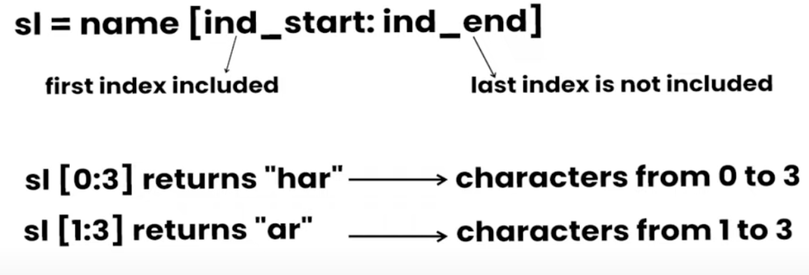
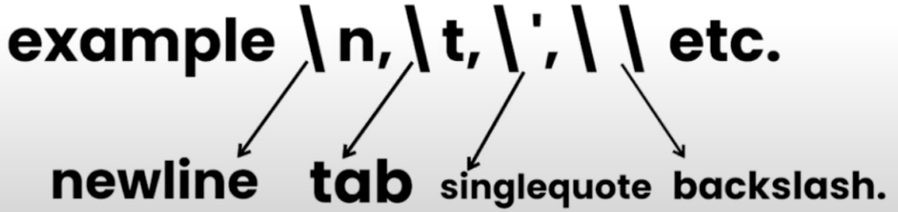
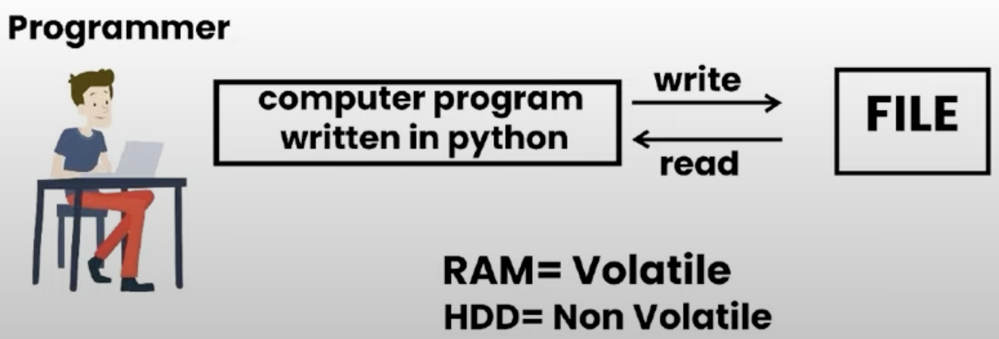

***[Python Practice]***  
<br/>
This Repository contains all the codes that I will be learning and writing while learning python simultaneously. Along with this, it will also be containing any projects that I believe would make sense doing.  
<br />

> Install modules using:
- `pip install -r requirements.txt` [Windows]  
or
- `pip3 install -r requirements.txt` [Mac]  
<br />

> Module: A module is a file containing code written by someone else(usually) which can be imported and used in our programs  
<br />

> pip/pip3: It is the package manager for python. You can use pip/pip3 to install a module on your system  
<br />

> Types of Modules:
- Built in Modules [Pre-installed in Python]
- External Modules [Need to be installed using pip/pip3]  
<br />

> `REPL = Read Evaluate Print Loop` 
- Simply go to the terminal and type python/python3, it will open REPL to code  
<br />

-> # Single Line Comment

-> ''' Multi Line Comment'''  
<br />

> ERROR1: The error you're encountering suggests that Python is trying to use your script file named requests.py instead of the actual requests library. When you name your script the same as a module, it can lead to conflicts.

> A variable is a name given to a memory location in a program.
- variables: container to store a value
- keywords: reserved words in python and cannot be used to name a variable
- identifiers: class/function/variable name  
<br />  

> Types of Data Types in Python:
- Integers
- Floating Point Numbers
- String
- Boolean
- None  
<br />

> Python is a fantastic language that automatically identifies the tyoe of data for us.  

> Rules of defining a variable name(also applies to other identifiers)
- A variable name CAN contain alphabets, digits and underscores
- A variable name CAN only start with an alphabet or underscore
- A variable name CANNOT start with a digit
- No white space is allowed to be used inside a variable name:
- Eg.: my_name, isNegative, integer_1, _integer2  
<br />  

> Operators in Python:
- ```Arithmetic Operators: +,-,*,/ etc.```
- ```Assignment Operators: =,+=,-=, etc.```
- ```Comparison operators: ==,>,>=,<,!= etc.```
- ```Logical Operators: and, or, not.```  

<br />

> TYPE() function and TYPECASTING
- type() function is used to find the data type of a given variable in python
- A number can be converted into a string and vice_versa(if possible)
- There are many functions to convert one data type into another  
<br />

> INPUT() function:
- This function allows the user to take input from the keyboard as a string
- It is important to note that the output of input is always a string(even if integer or floating point number is entered)  
<br />

> STRINGS:
- String is a data type in Python
- String is a sequence of characters enclosed in quotes
- Python strings are "immutable" which means they cannot be changed after they are created (Java strings also use this immutable style). Since strings can't be changed, we construct *new* strings as we go to represent computed values.
- We can primarily write a string in three(3) ways:
    - Single quoted string
    - Double quoted string
    - Triple quoted string

<br />   

> String Slicing: 
- A String in Python can be sliced for getting part of strings
- For eg.: name = "Swap" => Length=4 | Index = [0 1 2 3]
- The index in a string starts from 0 ends at (length - 1) in Python.
- In order to slice a string, we can use the following syntax:  

<br />  

- Negative indeces can also be used. -1 corresponds to the (length - 1) index, -2 to (length - 2)
- Slicing with Skip Value:
    - We can provide a skip value as part of our slice like this:
    - word = "amazing"
    - word[1 : 6 : 2] # "mzn" --> Here 1st to 6th index is the value and we have to skip it by the third value = 2, so take every second word
    - Other advanced slicing techniques are mentioned in: Learning Codes with Indexing/10_negative_slicing.py

<br />   

> String Functions:
- ```len(String)```: This function returns the length of the string. Return type = Integer.
- ```String.endswith("any_substring_or_letter")```: This function checks whether a particular string ends with a particular letter/letters. Return type = Boolean.
- ```String.count("c")```: This function counts the occurence of any particular letter in a string. Return type = Integer.
- ```String.capitalize()```: This function capitalize the FIRST CHARACTER of a given string. Return type = String.
- ```String.upper()```: Converts an string to upper case. Return type = String.
- ```String.lower()```: Converts an entire string to lower case. Return type = String.
- ```String.title()```: Capitalizes the first letter of each word in the String. Return type = String.
- ```String.strip()```: Removes leading and trailing whitespaces from a String. Return type = String.
- ```String.lstrip()```: Removes leading whitespace. Return type = String.
- ```String.rstrip()```: Removes trailing whitespace. Return type = String.
- ```String.find(word)```: This function finds a word and returns the index of the first occurence of that word in that String. Return type = Integer.
- ```String.replace(oldword, newword)```: Replaces an entire word in a String with a new word. Return type = String.

<br />   

> Escape Sequence Characters:
- Sequence of characters after backslash '\' is/are known as Escape Sequence Characters
- They comprise of more than one character but represent one character when used within the Strings.  

<br />  

> List and Tuples:
- Python Lists are containers to store a set of values of any data type
- example: ```friends = ["Hello", 18, true, "Swap.GG"]```

<br />   

> List Indexing:
- A list can be indexed and sliced just like a String via using nth indexes.

<br />   

> List Methods:
- Consider the following List:
    - L1 = [1,8,7,2,21,15]
        - ```L1.sort()```: updates the list to [1,2,7,8,15,21]
        - ```L1.reverse()```: updates the list to [15,21,2,7,8,1]
        - ```L1.append(8)```: adds '8' at the end of the list
        - ```L1.insert(3,8)```: This will add '8' at the 3rd index
        - ```L1.pop(2)```: Will delete element at 2nd index and return it's value
        - ```L1.remove(21)```: will remove '21' from the list

> Tuples:
- A tuple is a immutable data type in Python
    - ```a = ()``` # Empty Tuple
    - ```a = (1,)``` # Tuple with one one element needs a comma
    - ```a = (1,7,2)``` # Tuple with more than one element
- Tuple methods:
    - Consider the following Tuple: a = (1,7,2)
    - ```a.count(1)``` ==> Returns the number of times '1' occurs in the tuple
    - ```a.index(1)``` ==> Returns the first occurence of '1' in a
    - ```tuple_a + tuple_b``` -> Concatenation: Joins two tuples to form a single one
    - (Membership) -> ```print(1 in a)``` ==> True # To check whether a no/element is present in a tuple or not
    - ```len()``` ==> Length of a tuple
    - ```min() & max()``` ==> Minimum and Maximum values in a Tuple
    - ```Slicing``` ==> Returns a New Tuple after slicing
    - ```Unpacking``` -> b , c , d = a -> print(a, b, c) ==> 1 7 2

<br />   

> Dictionary & Sets:
- Disctionary is a collection of key value pairs
- Syntax:
    - ```a = {"key":"value",```
    ```"swap":"gg",```
    ```"marks":100,```
    ```"list":[1,2,9]```
    ```}```
    - ```a[key]``` ==> Prints the Value of the key
    - ```a[list]``` ==> Prints [1,2,9]
- Properties of Python Dictionaries:
    - It is unordered
    - It is mutable
    - It is indexed
    - Cannot contain duplicate keys

<br />  

> Dictionary Methods:
- ```a.items()``` ==> Returns a set of (key,value) tuples
- ```a.keys()``` ==> Returns a list containing dictionary key's
- ```a.update()``` ==> Updates the dictionary with supplied key-value pairs
- ```a.get()``` ==> Returns the values of the specified keys  
 
- More methods are available on https://docs.python.org

<br />  

> Difference between:
1. ```print(marks.get('A'))```  and,
2. ```print(marks['A'])```
- The main difference is that if 'A' does NOT exist in the dictionary, '1' returns 'None' as Output. However, '2' returns Error in the Code.

<br />  

> SETS
- Set is a collection of non-repetitive elements
- ```s=set()```  -> No repetition allowed
- ```s.add(1)```
- ```s.add(2)``` -> or s = {1,2}  
- If you are a programming beginner without much knowledge of mathematical operations on sets, you can simply look at sets in python as data types containing unique values  

> Properties of Sets:
- Sets are unordered ==> Set items are not in order
- Sets are unindexed ==> Cannot access set elements by index
- There is no way to change items in a set
- Sets cannot contain duplicate values  

> Operations on Sets:
- Covered in Code with Example  

<br/>  

> CONDITIONAL EXPRESSIONS:
- Sometimes we want to do one thing or the other if a certain condition is met.
- In Python programming too, we must be able to execute instructions on condition(s) being met
- This is what conditions are for.
- In Python, we mainly use ```[if, elif and else]```
- By default if the 'if' condition fails, the control moves to the 'else' condition
- Comparison/Relational and Logical Operators are used to build the logic inside conditional expressions
- ```Not(!)``` is is used to reverse the logic suppose a ```!= 5``` (means if a is NOT equals to 5)
- elif in Python means else if similar to other programming languages
- There can be multiple elif statements
- Last else executes only if all all the conditions inside elif fails  

<br/>  

> LOOPS IN PYTHON:
- Sometimes we want to repeat a set of statements in our program. For instance: Print 1 to 1000
- Loops make it easy for a programmer to tell the computer which set of instructions to repeat and how!
> Type of Loops in Python:
- Primarily there are two types of loops in Python-
    - ```'while'``` loops ==> Syntax: while(condition)
        - In while loops, the condition is checked first. if it evaluates to true, the body of the loop is executed otherwise not!
        - If the loop is entered, the process of [condition check and execution] is continued until the condition becomes False.
        - Note: If the condition never becomes False, **the loop keeps on getting executed infinitely**.
    - ``'for'`` loops ==> Syntax: for i in range(0 , n):
        - A for loop is used to iterate through a sequence like list, tuple or string[iterables]

> RANGE FUNCTION IN PYTHON
- The range() function in Python is used to generate a sequence of number.
- We can also specify the start, stop and step-size as follows:
    - ```range``` (start, stop, step_size)
    - #step_size is usually not used with ```range()```
    - ```for j in range(0,7):```
    - ```print(j) # Prints 0 to 6```

> FOR LOOP WITH ELSE
- An optional else can be used with a for loop if the code is to be executed when the loop exhausts
- example in [Learning Codes with Indexing/21_for_else.py]

> THE BREAK STATEMENT
- ```'break'``` is used to come out of the loop when encountered. It instructs the program to exit the loop whenever break is called.

> THE CONTINUE STATEMENT
- ```'continue'``` is used to stop the current iteration of the loop and continue with the next one. It instructs the program to 'skip this iteration'

> THE PASS STATEMENT
- ```'pass'``` is a null statement in python
- It instructs basically to do nothing
- It can be used with testing frameworks for eg.:
- ```pytest.pass```  
<br/>  

> FUNCTIONS AND RECURSIONS
- A Function is a group of statements performing a specific task
- When a program gets bigger in size and it's complexity grows, it gets difficult for a coder to keep track on which piece of code is doing what!
- A single function can be used by a coder in a programmer any number of times  
<br/>  

> Example and Syntax of a Function
- The syntax of a function in Python is as follows:
- ```def func1():```
- &emsp;&emsp;&ensp;```print("Hello")```
- This function can be called any number of times in the code to print ``Hello``  
<br/>  

> FUNCTION CALL
- Whenever we want to call a function, we put the name of the function followed by parantheses as follows:
- ``func1()`` # This is called the function call  
<br/>  

> FUNCTION DEFINITION
- The part containing the exact set of instructions which are executed during the fnction call  
<br/>  

> TYPES OF FUNCTIONS IN PYTHON
- There are two types of functions in Python:
    - Built In Functions(Already present in Python),
        - eg.: ``len(), print(), range()``, etc. 
    - User Defined Functions(Defined by the User)
        - The `func1()` we defined earlier is an example of user defined function  
<br/>  

> FUNCTIONS WITH ARGUMENTS
- A function can accept some value(s) it can work with. We can put these values in the paranthesis. Annything written within the paranthesis is known as the Function Parameter/Argument.
- A function can also return some value as shown below:
    - `def func()`:
    - &emsp;&emsp;&ensp;`return name`  
<br/>  

> DEFAULT PARAMETER VALUE
- We can have a value as a default argument in a function.
- If we specify `name="Stranger"` in the line containing the function definition, then `Good Day Stranger!` will be printed.  
<br/>  

> RECURSION
- Recursion is a function which calls itself
- It is used to directly use a mathematical formula as a function
- Example: `factorial(n) = n x factorial(n - 1)`
- Code is written in: `27_Recursion_ex.py` Program.  

<br/>  

> Question: How do you prevent a python print() function from printing a new line at the end?
- Answer: By writing this: `print("Hello World!", end = "")`  
<br/>  

> **[Project 1: Rock, Paper, Scissors, Game]**  
<br/>  

> FILE INPUT/OUTPUT (I/O)
- The random-access memory is volatile, and all it's contents are lost once a program terminates in order to persist the data forever, we use files.
- A file is a data stored in a storage device. A Python Program can talk to the file by reading content from it and writing content to it.  

<br/>  

> Types of Files
- There are basically 2 types of files:
    - Text files (.txt, .c etc)
    - Binary files (.jpg, .dat, etc)
- Python has a lot of functions for reading, updating and deleting files.  
<br/>  

> OPENING A FILE IN PYTHON
- Python has an `open()` function for opening files. It takes 2 parameters: filename and made.
    - # open("filename", "mode of opening(read mode)")
    - `open("this.txt", "v")`  <br/>  

> READING A FILE IN PYTHON
- `f = open("Learning Codes with Indexing/file.md") # Opens up the file from the directory`
- `data = f.read() # Reads the file`
- `print(data) # Prints the data from the file`
- `f.close() # CLoses the file after reading`  
<br/>  

> OTHER METHODS TO READ THE FILE
- We can also use `f.readline()` function to read one full line at a time  
<br/>  

> METHODS OF OPENING A FILE
- `r`  -> Open for Reading
- `w`  -> Open for Writing
- `a`  -> Open for Appending
- `+`  -> Open for Updating : used as `"w+"`, `"r+"` etc.
- `rb` -> Will open for read in Binary Mode
- `rt` -> Will open for read in Text mode  
<br/>  

> METHOD TO WRITE FILES IN PYTHON
- In order to write to a file in Python, we first open it in write mode or append mode after which, we use the python's `f.write()` method to write the file.
- Code has been written in `Learning Codes with Indexing/29_file_writing.py`  
<br/>  

> WITH STATEMENT
- It is always preferable to use `with open()` function while performing operations with files
- The best way to open and close the file automatically is by using the `with` statement
- Open the file in read mode using `with` which automatically closes the file
- Code has been written in `Learning Codes with Indexing/30_with_st.py`
- Syntax: `with open("filename", mode) as f:` -> Codes written in Practice Set 9.  
<br/>  

> *OBJECT ORIENTED PROGRAMMING*
- Solving a problem by creating object is one of the most popular approaches in programming. This is called Object-Oriented Programming.
- This concept focuses on using reusable code (DRY Principle).  
<br/>  

> CLASS
- A class is a blueprint for creating an object.  

<br/>  

- Syntax:
- `class Employee:` # Class name is written in pascal case
-        `# Methods and Variables`  
<br/>  

> OBJECT
- An object is an instantiation of a class. When class is defined, a template(info) is defined. Memory is allocated only after object instantiation.
- Objects of a given class can invoke the methods available to it without revealing the implementation detailed to the user.  
<br/>  

> MODELLING A PROBLEM IN OOPS
- We identify the following in our problem:
    - Noun -> Class -> Employee
    - Adjective -> Attributes -> name, age, salary
    - Verbs -> Methods -> getSalary(), increment()  
<br/>  

> CLASS ATTRIBUTES
- An attribute that belongs to the entire class rather than a particular object  
<br/>  

> INSTANCE ATTRIBUTES
- An attribute that belongs to the instance (object). Example:
- `employee.name = "Swap"`
- `employee.job = "Automation"`
- *Note: Instance attributes take preference over class attributes during assignment and retrieval*
- For refernce look into "Learning Codes with Indexing/32_ins_vs_class.py"
- When looking up for `obj_emp.laptop`, it checks for the following in order:
    - Is attribute present in the object?
    - Is attribute present in the class?  
<br/>  

> **SELF PARAMETER**
- self refers to the instance of the class. It is automatically passed with a function call from an object
- `swap.getSalary()` -> Here `self` is `swap`
- Equivalent to `Employee.getSalary(swap)`  
<br/>  

> STATIC METHOD
- Sometimes we need a function that does not use the self-parameter. We can define a static method like this:
- `@staticmethod` *decorator to mark a static method*
- `def greet()`
    - `print("Hello!")`  
<br/>  

> __init__ Constructor
- `__init__()` is a special method which is first run as soon as the object is created.
- `__init__()` method is also known as a constructor.
- It takes `self` argument and can also take further arguments.
- Example in: [Learning Codes with Indexing/34_init_const.py]
- Quote: The `__init__.py` files are required to make Python treat the directories as containing packages; this is done to prevent directories with a common name, such as string, from unintentionally hiding valid modules that occur later on the module search path.  
<br/>  

> INHERITANCE AND MORE ON OOPS  
- Inheritance is a way of creating a new class from an existing class.
- Syntax: written in `"Learning Codes with Indexing/35_inh_ex.py"`
- We can use the method and attributes of 'Employee' in 'Programmer' object
- Also, we can overwrite or add new attributes and methods in 'Programmer' class  
<br/>  

> TYPES OF INHERITANCE
- `Single Inheritance`: Occurs when a child class inherits only a single parent class. `[BASE ---> DERIVED]`
- `Multiple Inheritance`: Occurs when the child class inherits from more than one parent classes. `[Parent_1 + Parent_2 ---> Child]`
- `Multilevel Inheritance`: When a child class becomes a parent of another class. `[Parent ---> Child_1 ---> Child_2]`  
<br/>  

> SUPER() METHOD:
- `super()` method is used to access the methods of a super class in the derived class.
- Syntax: `super().__init__()`  
<br/>  

> CLASS METHOD:
- A class method which is bound to the class and not the object of the class.
- `@classmethod` *decorator is used to create a class method*
- Syntax: Written in `Learning Codes with Indexing/38_class_methods.py`  
<br/>  

> PROPERTY DECORATORS:
- Syntax written in `Learning Codes with Indexing/39_property_decorators.py`
- If `e = Employee()` is an object of class Employee, we can print `e.name` to print the ename by internally calling name function.  
<br/>  

> GETTERS AND SETTERS
- The method name with `@property` is called Getter Method.
- We can define a `function + @name.setter` decorator as shown in the above example.  
<br/>  

> OPERATORS OVERLOADING IN PYTHON
- Operators in Python can be overloaded using dunder methods.
- These methods are called when a given operator is used on the objects.
- Operators in Python can be overloaded using the following methods:
    - `p1 + p2` *add* --> `__add__`
    - `p1 - p2` *sub* --> `__sub__`
    - `p1 * p2` *mul* --> `__mul__`
    - `p1 / p2` *truediv* --> `__truediv__`
    - `p1 // p2` *floordiv* --> `__floordiv__`
- Other dunder/magic methods in Python:
    - `str__()` *used to set what gets displayed upon calling `str(obj)`*
    - `__len__()` *used to set what gets displayed upon calling `__len__()` or `len(obj)`*  
<br/>  

> NEWLY ADDED FEATURES IN PYTHON
- Following are some of the newly added features in Python programming language:  
<br/>
- WALRUS OPERATOR
    - The walrus operator `:=`, introduced in Python 3.8 allows us to assign values to variables as part of an expression. This operator, named for it's resemblance to the eyes and tusks of a walrus, is officially called the `"assignment expression"`.
    - Syntax written in `Learning Codes with Indexing/41_walrus_op.py`
- TYPE DEFINITIONS IN PYTHON
    - Type hints are added using the colon `:` syntax for variables and the `->` syntax for function return types.
    - Syntax written in `Learning Codes with Indexing/42_type_hint.py`
    - Type hints make the code easier to understand as to what the data type is for any variable
- ADVANCED TYPE HINTS
    - Python's typing module provides more advanced type hints, such as List, Tuple, Dict, and Union.
    - You can import List, Tuple and Dict types from the typing module like this:
    - `from typing import List, Tuple, Dict, Union`
    - Syntax written in `Learning Codes with Indexing/42_type_hint.py`
    - These annotations help in making the code self-documenting and allow developers to understand the data structures used at a glance.
- MATCH CASE
    - Python 3.10 introduced the `match` statement, which is similar to the switch statement found in other programming languages
    - The basic syntax of the `match` statement involves matching a variable against several cases using the case keyword
    - Syntax written in `Learning Codes with Indexing/43_match_case.py`
- DICTIONARY MERGE & UPDATE OPERATORS
    - New operators `|` and `|=` allow for merging and updating dictionaries
    - You can use multiple context managers in a single with statement more cleanly using the parenthesised context manager
    - Syntax written in `Learning Codes with Indexing/44_dict_merge_update.py`
- EXCEPTION HANDLING IN PYTHON
    - There are many built-in exceptions which are raised in Python when something goes wrong.
    - Exception in pyhton can be handled using try-except statement. The code that handles the exception is written in the except clause
    - When the exception is handled, the code flow continues without program interruption.
    - Syntax written in `Learning Codes with Indexing/44_dict_merge_update.py`